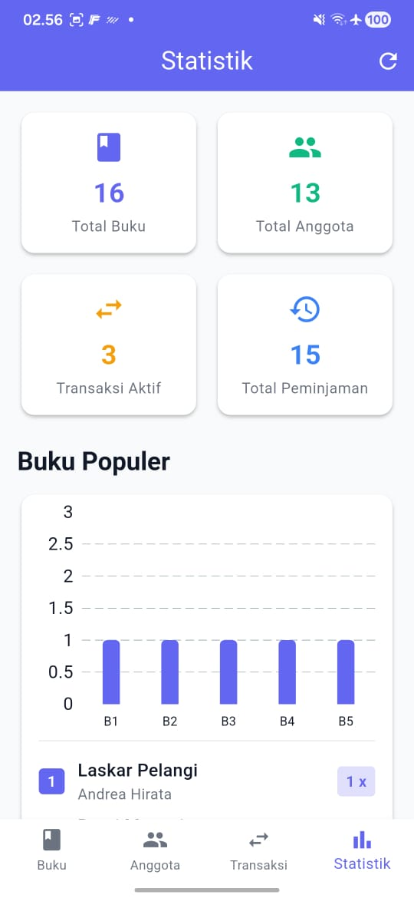
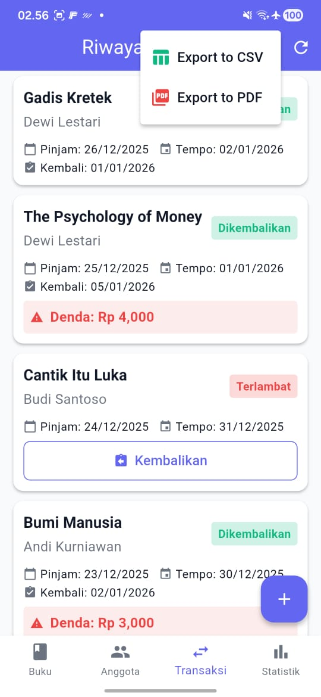
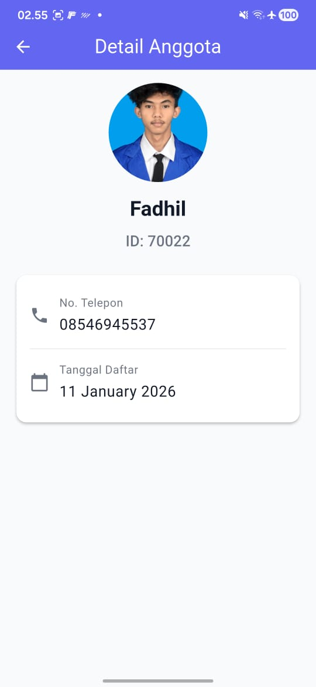
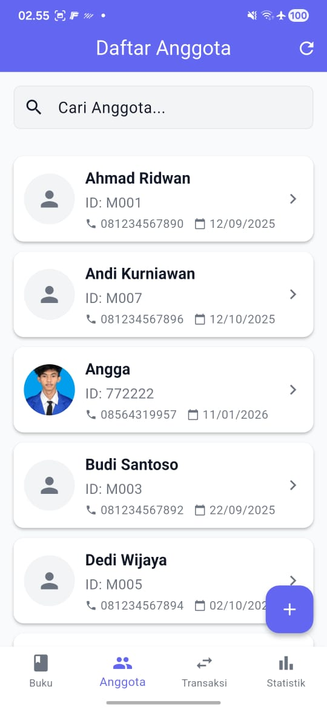
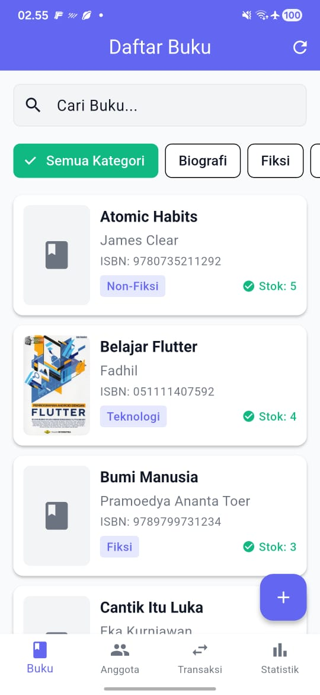
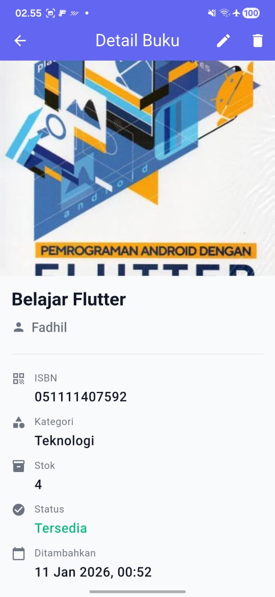

# PerpusKu - Mini Library Management System


## Deskripsi

PerpusKu adalah aplikasi manajemen perpustakaan mini yang dirancang untuk sekolah atau komunitas kecil. Aplikasi ini membantu dalam pengelolaan koleksi buku, anggota perpustakaan, dan transaksi peminjaman dengan antarmuka yang sederhana dan intuitif.

## Fitur Utama

### Module 1: Book Catalog (Katalog Buku)

- CRUD (Create, Read, Update, Delete) data buku
- Upload foto cover buku menggunakan kamera atau galeri
- Detail buku lengkap (judul, pengarang, kategori, ISBN, stok)
- Pencarian dan filter buku berdasarkan kategori
- Status ketersediaan buku otomatis

### Module 2: Borrowing System (Sistem Peminjaman)

- Registrasi anggota dengan foto
- Transaksi peminjaman buku
- Pengembalian buku dengan perhitungan denda otomatis
- Riwayat peminjaman per anggota
- Denda Rp 1.000 per hari keterlambatan
- QR/Barcode Scanner untuk ISBN buku
- Push Notifications untuk reminder pengembalian

### Module 3: Statistics & Reports (Statistik & Laporan)

- Dashboard ringkasan (total buku, anggota, transaksi)
- Grafik buku populer dengan visualisasi bar chart
- Daftar buku terlambat
- Ringkasan transaksi bulanan
- Export data ke CSV dan PDF
- REST API Integration ready

## Screenshots

### 1. Statistics Dashboard


_Dashboard statistik dengan grafik buku populer dan ringkasan data perpustakaan_

### 2. Transaction List


_Daftar transaksi peminjaman dengan status, denda, dan fitur export CSV/PDF_

### 3. Member Detail


_Detail informasi anggota dengan foto dan riwayat peminjaman_

### 4. Member List


_Daftar anggota perpustakaan dengan fitur pencarian dan foto profil_

### 5. Home Screen


_Dashboard utama dengan navigasi bottom bar dan ringkasan statistik_

### 6. Book Detail


_Detail informasi buku lengkap dengan cover, stok, dan status ketersediaan_

## Tech Stack

- **Framework**: Flutter 3.x
- **Language**: Dart 3.x
- **State Management**: Provider
- **Local Database**: SQLite (sqflite)
- **Image Handling**: image_picker
- **Charts**: fl_chart
- **Date Formatting**: intl
- **Storage**: path_provider
- **QR/Barcode Scanner**: mobile_scanner
- **Push Notifications**: flutter_local_notifications
- **Export**: csv, pdf, printing
- **REST API**: http
- **Permissions**: permission_handler

## Database Schema

### Books Table

```sql
CREATE TABLE books (
  id INTEGER PRIMARY KEY AUTOINCREMENT,
  title TEXT NOT NULL,
  author TEXT NOT NULL,
  isbn TEXT NOT NULL UNIQUE,
  category TEXT NOT NULL,
  stock INTEGER NOT NULL DEFAULT 0,
  cover_photo TEXT,
  created_at TEXT NOT NULL
)
```

### Members Table

```sql
CREATE TABLE members (
  id INTEGER PRIMARY KEY AUTOINCREMENT,
  name TEXT NOT NULL,
  member_id TEXT NOT NULL UNIQUE,
  phone TEXT NOT NULL,
  photo TEXT,
  registration_date TEXT NOT NULL
)
```

### Transactions Table

```sql
CREATE TABLE transactions (
  id INTEGER PRIMARY KEY AUTOINCREMENT,
  book_id INTEGER NOT NULL,
  member_id INTEGER NOT NULL,
  borrow_date TEXT NOT NULL,
  due_date TEXT NOT NULL,
  return_date TEXT,
  fine REAL NOT NULL DEFAULT 0,
  status TEXT NOT NULL,
  FOREIGN KEY (book_id) REFERENCES books (id) ON DELETE CASCADE,
  FOREIGN KEY (member_id) REFERENCES members (id) ON DELETE CASCADE
)
```

## Cara Menjalankan Aplikasi

### Prerequisites

- Flutter SDK (versi 3.0 atau lebih baru)
- Android Studio / VS Code dengan Flutter extension
- Android device atau emulator

### Installation Steps

1. **Clone repository**

```bash
git clone <repository-url>
cd perpusku
```

2. **Install dependencies**

```bash
flutter pub get
```

3. **Jalankan aplikasi**

```bash
flutter run
```

### Build APK untuk Testing

```bash
# Build APK debug
flutter build apk --debug

# Build APK release
flutter build apk --release
```

APK hasil build akan tersimpan di: `build/app/outputs/flutter-apk/`

### Download APK untuk Testing

**Release APK (Recommended)**

- File: `app-release.apk`
- Size: 64.6 MB
- Path: `build/app/outputs/flutter-apk/app-release.apk`
- Status: Ready for testing and submission
- Download: [Link akan ditambahkan setelah upload ke hosting/release]

**Debug APK**

- File: `app-debug.apk`
- Path: `build/app/outputs/flutter-apk/app-debug.apk`
- Status: For development testing only

> **Installation**: Download APK, enable "Install from Unknown Sources" di Android device, kemudian install file APK.

### Build AAB untuk Play Store

```bash
flutter build appbundle --release
```

AAB hasil build akan tersimpan di: `build/app/outputs/bundle/release/`

## Struktur Proyek

```
lib/
├── core/
│   ├── constants/
│   │   ├── app_colors.dart
│   │   └── app_strings.dart
│   ├── database/
│   │   └── database_helper.dart
│   ├── services/
│   │   ├── api_service.dart
│   │   ├── notification_service.dart  # Push notifications
│   │   ├── scanner_service.dart      # QR/Barcode scanner
│   │   └── export_service.dart       # CSV & PDF export
│   ├── theme/
│   │   └── app_theme.dart
│   └── widgets/
│       ├── empty_state.dart
│       └── loading_overlay.dart
├── features/
│   ├── books/
│   │   ├── models/
│   │   │   └── book.dart
│   │   ├── providers/
│   │   │   └── book_provider.dart
│   │   ├── screens/
│   │   │   ├── book_list_screen.dart
│   │   │   ├── book_detail_screen.dart
│   │   │   └── book_form_screen.dart
│   │   └── widgets/
│   │       └── book_card.dart
│   ├── members/
│   │   ├── models/
│   │   │   └── member.dart
│   │   ├── providers/
│   │   │   └── member_provider.dart
│   │   ├── screens/
│   │   │   ├── member_list_screen.dart
│   │   │   ├── member_detail_screen.dart
│   │   │   └── member_form_screen.dart
│   │   └── widgets/
│   │       └── member_card.dart
│   ├── transactions/
│   │   ├── models/
│   │   │   └── transaction.dart
│   │   ├── providers/
│   │   │   └── transaction_provider.dart
│   │   ├── screens/
│   │   │   ├── transaction_list_screen.dart
│   │   │   ├── borrow_screen.dart
│   │   │   └── return_screen.dart
│   │   └── widgets/
│   │       └── transaction_card.dart
│   └── statistics/
│       └── screens/
│           └── statistics_screen.dart
├── screens/
│   └── home_screen.dart
└── main.dart
```

## Fitur Unggulan

### Offline-First Architecture

- Semua data disimpan secara lokal menggunakan SQLite
- Aplikasi berfungsi penuh tanpa koneksi internet
- Data persisten dan aman

### QR/Barcode Scanner

- Scan ISBN buku dengan kamera untuk input cepat
- Mendukung berbagai format barcode (EAN-13, UPC, Code-128, dll)
- Toggle flash dan switch camera

### Push Notifications

- Reminder otomatis 1 hari sebelum jatuh tempo
- Notifikasi harian untuk buku yang terlambat
- Scheduled notifications dengan timezone support

### Export Data

- Export transaksi ke CSV untuk analisis di Excel
- Generate PDF report profesional dengan formatting
- Share atau print PDF langsung dari aplikasi
- Export daftar buku dan anggota

### REST API Ready

- Service layer lengkap untuk integrasi backend
- CRUD operations untuk semua entitas
- Sync data to/from server
- Connection health check

### User-Friendly Interface

- Material Design 3 dengan tema modern
- Navigasi intuitif dengan bottom navigation bar
- Responsive layout untuk berbagai ukuran layar

### Automatic Calculations

- Perhitungan denda otomatis berdasarkan keterlambatan
- Update stok buku otomatis saat peminjaman/pengembalian
- Status transaksi otomatis (borrowed/overdue/returned)

### Data Visualization

- Grafik bar interaktif untuk buku populer
- Dashboard statistik real-time
- Indikator visual untuk status ketersediaan

## Permissions

Aplikasi memerlukan permission berikut:

- **CAMERA**: Untuk mengambil foto cover buku, foto anggota, dan scan barcode/QR
- **READ_MEDIA_IMAGES**: Untuk memilih gambar dari galeri (Android 13+)
- **READ_EXTERNAL_STORAGE**: Untuk akses galeri (Android 12 ke bawah)
- **WRITE_EXTERNAL_STORAGE**: Untuk menyimpan foto (Android 12 ke bawah)
- **INTERNET**: Untuk REST API communication (optional)
- **POST_NOTIFICATIONS**: Untuk push notifications (Android 13+)
- **SCHEDULE_EXACT_ALARM**: Untuk scheduled reminders

## API Documentation

### BookProvider

```dart
// Load all books
await bookProvider.loadBooks();

// Add new book
await bookProvider.addBook(book);

// Update book
await bookProvider.updateBook(book);

// Delete book
await bookProvider.deleteBook(bookId);

// Search books
bookProvider.setSearchQuery("flutter");

// Filter by category
bookProvider.setCategory("Teknologi");
```

### MemberProvider

```dart
// Load all members
await memberProvider.loadMembers();

// Add new member
await memberProvider.addMember(member);

// Update member
await memberProvider.updateMember(member);

// Delete member
await memberProvider.deleteMember(memberId);

// Search members
memberProvider.setSearchQuery("John");
```

### TransactionProvider

```dart
// Load all transactions
await transactionProvider.loadTransactions();

// Borrow book (with automatic notification scheduling)
await transactionProvider.borrowBook(bookId, memberId, durationDays);

// Return book (with fine calculation)
await transactionProvider.returnBook(transactionId);

// Get transactions by member
final transactions = await transactionProvider.getTransactionsByMember(memberId);

// Get overdue transactions
final overdueList = transactionProvider.overdueTransactions;
```

### API Service

```dart
// Set API base URL in lib/core/services/api_service.dart
static const String baseUrl = 'https://your-api-server.com/api';

// Set auth token
ApiService().setAuthToken('your-jwt-token');

// Fetch books from server
final books = await ApiService().getBooks();

// Create book on server
final newBook = await ApiService().createBook(book);

// Sync local data to server
await ApiService().syncToServer(
  books: localBooks,
  members: localMembers,
  transactions: localTransactions,
);

// Check server connection
final isOnline = await ApiService().checkConnection();
```

### Notification Service

```dart
// Initialize notifications (called in main.dart)
await NotificationService().initialize();

// Schedule daily overdue check (9 AM)
await NotificationService().scheduleDailyOverdueCheck();

// Schedule return reminder (1 day before due)
await NotificationService().scheduleReturnReminder(
  transactionId,
  bookTitle,
  dueDate,
);

// Check and notify overdue books now
await NotificationService().checkAndNotifyOverdueBooks();

// Cancel notification
await NotificationService().cancelNotification(notificationId);
```

### Scanner Service

```dart
// Scan barcode/QR code
final result = await ScannerService.scanBarcode(context);
if (result != null) {
  isbnController.text = result; // Use scanned value
}
```

### Export Service

```dart
// Export transactions to CSV
final csvFile = await ExportService().exportTransactionsToCSV(transactions);
// File saved to: /data/user/0/.../files/transactions_20260110_143020.csv

// Export transactions to PDF
final pdfFile = await ExportService().exportTransactionsToPDF(transactions);

// Share PDF
await ExportService().sharePDF(pdfFile);

// Print PDF
await ExportService().printPDF(pdfFile);

// Export books to CSV
final booksCSV = await ExportService().exportBooksToCSV(books);

// Export members to CSV
final membersCSV = await ExportService().exportMembersToCSV(members);
```

// Update member
await memberProvider.updateMember(member);

// Delete member
await memberProvider.deleteMember(memberId);

````

### TransactionProvider

```dart
// Load all transactions
await transactionProvider.loadTransactions();

// Borrow book (bookId, memberId, durationDays)
await transactionProvider.borrowBook(1, 2, 7);

// Return book
await transactionProvider.returnBook(transactionId);

// Get overdue transactions
final overdueList = transactionProvider.overdueTransactions;
````

## Contributing

Contributions are welcome! Please feel free to submit a Pull Request.

## License

This project is licensed under the MIT License - see the LICENSE file for details.

## Developer

Developed for educational purposes.

## Support

Jika mengalami masalah atau memiliki pertanyaan, silakan buka issue di repository ini.

---

**Note**: Aplikasi ini dibuat untuk keperluan pembelajaran dan dapat dikembangkan lebih lanjut sesuai kebutuhan.
